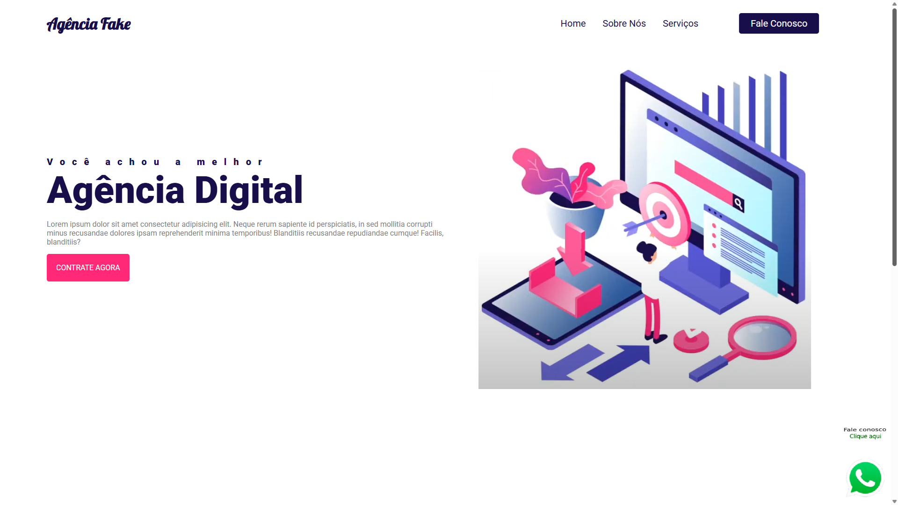
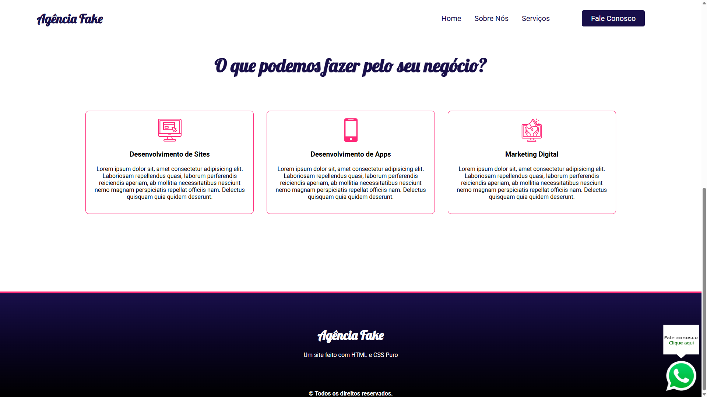

<h1 align="center">Agência Fake 💼✨</h1>

<p align="center">
  
  
</p>

<p align="center">
  <strong>A fictional digital agency landing page built with HTML and CSS.</strong><br />
  <a href="https://guimartim.github.io/agencia-fake/" target="_blank">🔗 Visit the live site</a>
</p>

---

## 🖼️ Preview


<br>


---

## 🧠 About the Project

This website simulates a **fictional digital agency** and was developed with the goal of practicing:

- Structuring with HTML5
- Styling with CSS3
- Organizing sections and navigation
- Clean and modern layout
- Visual interactivity using CSS

This project is part of my studies in **Systems Analysis and Development**.

---

## 💬 Project Highlights

- ✅ **Floating WhatsApp Button**  
  A WhatsApp icon is positioned in the corner of the screen with a direct link for customer contact. It simulates a quick support channel.

- ✅ **Interactive Cards with Hover Effect**  
  Service cards highlight on hover, with subtle changes in color, shadow, and scale. This improves the user experience with modern visual touches!

---

## 📚 Website Sections

🔹 **Home**  
Introduction with the agency’s main tagline.

🔹 **About Us**  
Overview of the agency’s mission and who we are.

🔹 **Services**  
A list of the main services offered.

🔹 **Contact Us**  
A simple (static) contact form.

---

## 📁 Technologies Used

- HTML5
- CSS3

> No libraries or frameworks were used. This project was built entirely with pure HTML and CSS!

---

## 🚀 How to View the Project

You can view it directly via GitHub Pages:

👉 [https://guimartim.github.io/agencia-fake/](https://guimartim.github.io/agencia-fake/)

Or clone this repository and open the `index.html` file in your browser:

```bash
git clone https://github.com/guimartim/agencia-fake.git
cd agencia-fake
start index.html
```
